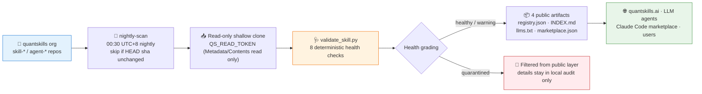

# 🗃️ QUANTSKILLS Registry

[简体中文](README.md) | **English**

> The public asset directory and display layer of the quantskills organization: a nightly read-only scan walks every `skill-*` / `agent-*` repository, runs 8 deterministic health checks, and auto-generates a machine index, a human directory, an LLM discovery index, and a Claude Code marketplace feed — quarantined assets and audit details never enter the public layer.

**Creator / Maintainer**: [`abgyjaguo`](https://github.com/abgyjaguo)

<p align="center">
  
  
  
  
  
  
</p>

---

## 📖 What is this

`quantskills/registry` is the **public display layer** of the QUANTSKILLS ecosystem. It answers five questions:

- What public skills and agents exist?
- What is each asset for?
- Which category and tags does it declare?
- Which agent platforms does it support?
- What public validation level does it declare?

It is **not** an internal issue list: detailed audits, `health_items`, and human-review records live only in maintainers' local audit output and are filtered out of the public layer entirely. `quarantined` repositories never appear in any public artifact.

---

## ⚡ Nightly Pipeline



The pipeline is driven by [`.github/workflows/nightly-scan.yml`](.github/workflows/nightly-scan.yml) (UTC 16:30 = 00:30 Beijing time, manual `--full` dispatch supported); artifacts are committed back to this repository as `qs-registry-auditor` — the **only write operation** in the entire pipeline.

---

## 📦 Four Public Artifacts

| File | Audience | Stable URL |
|---|---|---|
| [`registry.json`](registry.json) | Websites, tools, automation | `https://raw.githubusercontent.com/quantskills/registry/main/registry.json` |
| [`INDEX.md`](INDEX.md) | Humans, browsing by type/category | Read it right here |
| [`llms.txt`](llms.txt) | LLM / AI agent discovery | Deployed as `https://quantskills.ai/llms.txt` |
| [`.claude-plugin/marketplace.json`](.claude-plugin/marketplace.json) | Claude Code plugin marketplace | `/plugin marketplace add quantskills/registry` |

All four files are auto-generated by `build_registry.py` — **do not edit by hand**. Public `registry.json` intentionally excludes `health_items`, internal scan failures, and local audit notes.

---

## 🩺 Eight Deterministic Health Checks

[`scripts/validate_skill.py`](scripts/validate_skill.py) makes factual judgments only; semantic judgments (tag accuracy, sensitive content, documentation drift) belong to the read-only review agent defined in [`AGENTS.md`](AGENTS.md), which writes recommendations but never modifies repositories.

| Check | Level | What it verifies |
|---|---|---|
| `required-files` | fail | Declaration file (`SKILL.md`/`AGENTS.md`), `README.md`, and `LICENSE` must all exist |
| `frontmatter` | fail / warn | Parseable YAML frontmatter and `name` are fail-level; description ≥60 chars with "Use when", required `quantSkills` fields and enums are warn-level |
| `path-refs` | fail / warn | Markdown links must point to existing in-repo files (dead link = fail); missing backtick-mentioned paths and outside-repo references = warn |
| `git-hygiene` | fail / warn | Any file >10MB quarantines; data files >2MB (csv/parquet/json/db/zip, …) warn |
| `secrets` | fail | Lightweight regex scan for AWS keys, GitHub PATs, `sk-`-shaped API keys, Slack tokens |
| `trader-disclaimer` | fail | `trader-research` repos must carry both a "not investment advice" and a "not affiliated" statement (standard text in [`docs/templates/disclaimer_zh_en.md`](docs/templates/disclaimer_zh_en.md)) |
| `python-syntax` | fail | Every `.py` in the repo must pass `py_compile` |
| `requires` | warn | Repositories declared in `requires` must actually exist in the organization |

**Health grading**: any fail → `quarantined` (excluded from the public layer); warns only → `warning`; otherwise `healthy`. Script exit codes are 0 / 1 / 2 respectively.

---

## 🏷️ Asset Declaration Contract

- `skill-*` repositories declare via `SKILL.md`; `agent-*` repositories via `AGENTS.md`;
- metadata lives in the declaration file's `quantSkills` frontmatter — full JSON Schema in [`schema/frontmatter.schema.json`](schema/frontmatter.schema.json);
- public registry entry structure is defined in [`schema/registry.schema.json`](schema/registry.schema.json).

**Required `quantSkills` fields**:

| Field | Constraint |
|---|---|
| `category` | 14 enums — skill side: `trader-research` `factor` `data-api` `replication` `monitor` `analyst` `tooling`; agent side: `research-agent` `monitor-agent` `risk-agent` `workflow-agent` `review-agent` `data-agent` `automation-agent` |
| `tags` | 1–10 items, kebab-case |
| `platforms` | `claude-code` `codex` `openclaw` `cursor` `workbuddy` |
| `status` | `draft` / `active` / `stable` / `deprecated` |
| `validation_level` | See the three-level system below |
| `maintainer_type` | `official` / `community` |
| `summary_zh` / `summary_en` | 8–120 chars Chinese / 8–200 chars English, one-line card summaries |

**Three-level validation system**:

| Level | Meaning | Bar |
|---|---|---|
| 🥉 L1 `listed` | Listed | Default level |
| 🥈 L2 `runnable` | Runnable | Requires install instructions + example inputs/outputs |
| 🥇 L3 `verified` | Verified | Requires data sources, look-ahead checks, backtest evidence, risk notes |

---

## 📊 Current Snapshot

<!-- registry-snapshot:start -->
As of 2026-07-02: **38 skills / 7 agents**. Categories: `Tooling / tooling` 12 · `Factor Library / factor` 10 · `Analyst / analyst` 7 · `Monitor / monitor` 3 · `Replication / replication` 3 · `Data API / data-api` 2 · `Monitor Agent / monitor-agent` 2 · `Workflow Agent / workflow-agent` 2 · `Uncategorized / uncategorized` 2 · `Research Agent / research-agent` 1 · `Risk Agent / risk-agent` 1; validation levels L3 ×9 · L2 ×21 · L1 ×12 · production ×3.
<!-- registry-snapshot:end -->

> This snapshot changes with every nightly scan — [INDEX.md](INDEX.md) / [registry.json](registry.json) are the live sources of truth.

---

## 🚀 Quick Start

| You are | Start here |
|---|---|
| 👤 A user | Browse [INDEX.md](INDEX.md) and pick skills by category |
| 🤖 A Claude Code user | `/plugin marketplace add quantskills/registry` |
| 🌐 A website / tool developer | Pull the `registry.json` raw URL; field semantics in [`docs/SITE_INTEGRATION_zh.md`](docs/SITE_INTEGRATION_zh.md) |
| 🧠 An LLM / agent | Read [llms.txt](llms.txt) for lightweight discovery |
| ✍️ An asset author | Write frontmatter per [`schema/frontmatter.schema.json`](schema/frontmatter.schema.json), pre-check locally: `python scripts/validate_skill.py /path/to/your-repo` |
| 🔧 A maintainer | See [`docs/MAINTAINER_GUIDE.md`](docs/MAINTAINER_GUIDE.md) and [`docs/SECURITY_SETUP_zh.md`](docs/SECURITY_SETUP_zh.md) |

Local full build for maintainers:

```bash
pip install pyyaml requests
python scripts/validate_skill.py /path/to/skill-or-agent-repo   # single-repo pre-check
GITHUB_TOKEN=xxx python scripts/build_registry.py --full        # full org scan, rebuild all artifacts
# add --audit-dir reports to generate local scan-YYYYMMDD.json and human-review-YYYYMMDD.md (never committed publicly)
```

`GITHUB_TOKEN` only needs read access; public-only scans work without a token but may hit GitHub API rate limits.

---

## 🔒 Safety Boundary

The entire pipeline is **read-only** toward skill / agent repositories:

- scanning uses `QS_READ_TOKEN` (fine-grained PAT, Metadata: Read + Contents: Read only);
- no PRs, no branch pushes, no topics / description / homepage edits, no issue writes, no triggering other repositories, no AI auto-fixes;
- the only write operation commits generated public artifacts back to this repository (Actions' built-in `GITHUB_TOKEN`, `contents: write` scoped to this repo only);
- the companion read-only review agent's boundaries are in [`AGENTS.md`](AGENTS.md): summarize and recommend only; suspected secrets are reported by file path without repeating contents.

**Field stability contract**: `registry.json` fields are append-only — never changed or removed (backward compatible); breaking changes are announced in advance via issues in this repository. The registry refreshes nightly around 00:30–01:00 Beijing time; consumers are encouraged to use pull mode.

---

## 📁 Directory Layout

```
registry/
├── README.md / README.en.md            # This document (Chinese / English)
├── AGENTS.md                           # Read-only review agent: duties and hard boundaries
├── INDEX.md                            # 🤖 Auto-generated: human-readable directory
├── registry.json                       # 🤖 Auto-generated: public machine index
├── llms.txt                            # 🤖 Auto-generated: LLM/agent discovery index
├── .claude-plugin/marketplace.json     # 🤖 Auto-generated: Claude Code marketplace feed
├── .github/workflows/nightly-scan.yml  # Nightly read-only scan pipeline
├── schema/
│   ├── frontmatter.schema.json         # SKILL.md / AGENTS.md frontmatter contract
│   └── registry.schema.json            # registry.json entry structure
├── scripts/
│   ├── build_registry.py               # Scan org → validate → generate all artifacts
│   └── validate_skill.py               # Single-repo 8-check deterministic validator
└── docs/
    ├── MAINTAINER_GUIDE.md             # Maintainer guide
    ├── SECURITY_SETUP_zh.md            # Least-privilege setup checklist
    ├── SITE_INTEGRATION_zh.md          # quantskills.ai integration notes
    └── templates/disclaimer_zh_en.md   # Standard trader-research disclaimer text
```

---

## 📜 License

This project is licensed under the GNU General Public License v3.0 (`GPL-3.0`). See [`LICENSE`](LICENSE).

## 🐼 PandaAI / QUANTSKILLS Community

<div align="center">
  
  <br>
  <sub>Scan the QR code to join the PandaAI community for QUANTSKILLS skills, agent workflows, and quantitative research practice.</sub>
</div>
