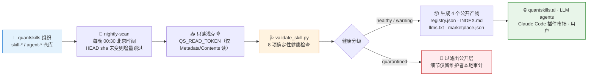

# 🗃️ QUANTSKILLS Registry

**简体中文** | [English](README.en.md)

> quantskills 组织的公开资产目录与展示层：每晚只读扫描全组织 `skill-*` / `agent-*` 仓库，跑完 8 项确定性健康检查后，自动生成机器索引、人类目录、LLM 发现索引和 Claude Code marketplace feed —— 隔离项与审计细节一律不进公开层。

**Creator / Maintainer**: [`abgyjaguo`](https://github.com/abgyjaguo)

<p align="center">
  
  
  
  
  
  
</p>


---

## 📖 这是什么

`quantskills/registry` 是 QUANTSKILLS 生态的**公开展示层**。它回答五个问题：

- 目前有哪些公开的 skill / agent？
- 每个资产适合解决什么问题？
- 它属于哪个分类，有哪些 tags？
- 它声明支持哪些 agent 平台？
- 它的公开验证等级是什么？

它**不是**内部问题清单：详细审计、`health_items`、人工复核记录只存在于维护者本地的审计产物中，公开层一概过滤。`quarantined`（被隔离）的仓库不会出现在任何公开产物里。

---

## ⚡ 每夜流水线



流水线由 [`.github/workflows/nightly-scan.yml`](.github/workflows/nightly-scan.yml) 驱动（UTC 16:30 = 北京时间 00:30，支持手动触发 `--full` 全量），产物以 `qs-registry-auditor` 身份提交回本仓库 —— 这是整条流水线**唯一的写操作**。

---

## 📦 四个公开产物

| 文件 | 给谁用 | 稳定 URL |
|---|---|---|
| [`registry.json`](registry.json) | 网站、工具、自动化系统 | `https://raw.githubusercontent.com/quantskills/registry/main/registry.json` |
| [`INDEX.md`](INDEX.md) | 人类，按 类型/分类 分组浏览 | 本仓库直接看 |
| [`llms.txt`](llms.txt) | LLM / AI agent 发现 | 部署为 `https://quantskills.ai/llms.txt` |
| [`.claude-plugin/marketplace.json`](.claude-plugin/marketplace.json) | Claude Code 插件市场 | `/plugin marketplace add quantskills/registry` |

四个文件全部由 `build_registry.py` 自动生成，**请勿手工编辑**。公开 `registry.json` 刻意不包含 `health_items`、内部扫描失败详情或本地审计备注。

---

## 🩺 八项确定性健康检查

[`scripts/validate_skill.py`](scripts/validate_skill.py) 只做事实判断；语义判断（标签准确性、敏感内容、文档漂移）交给 [`AGENTS.md`](AGENTS.md) 定义的只读复核 agent，且只写建议、不改仓库。

| 检查 | 级别 | 内容 |
|---|---|---|
| `required-files` | fail | 声明文件（`SKILL.md`/`AGENTS.md`）、`README.md`、`LICENSE` 缺一即隔离 |
| `frontmatter` | fail / warn | YAML frontmatter 可解析、`name` 必填为 fail；description ≥60 字符且含 "Use when"、`quantSkills` 必填字段与枚举为 warn |
| `path-refs` | fail / warn | Markdown 链接指向的仓库内文件必须存在（死链 fail）；反引号提及路径缺失、引用仓库外路径为 warn |
| `git-hygiene` | fail / warn | 单文件 >10MB 隔离；>2MB 的数据文件（csv/parquet/json/db/zip 等）warn |
| `secrets` | fail | 轻量正则扫 AWS Key、GitHub PAT、`sk-` 形态密钥、Slack token |
| `trader-disclaimer` | fail | `trader-research` 类目必须同时有「不构成投资建议」与「非官方/不隶属」声明（标准文案见 [`docs/templates/disclaimer_zh_en.md`](docs/templates/disclaimer_zh_en.md)） |
| `python-syntax` | fail | 仓库内所有 `.py` 必须通过 `py_compile` |
| `requires` | warn | `requires` 声明的依赖仓库必须真实存在于组织中 |

**健康分级**：出现任何 fail → `quarantined`（不进公开层）；只有 warn → `warning`；否则 `healthy`。脚本退出码对应 0 / 1 / 2。

---

## 🏷️ 资产声明契约

- `skill-*` 仓库用 `SKILL.md` 声明，`agent-*` 仓库用 `AGENTS.md` 声明；
- 元数据写在声明文件的 `quantSkills` frontmatter 中，完整 JSON Schema 见 [`schema/frontmatter.schema.json`](schema/frontmatter.schema.json)；
- 公开注册表条目结构见 [`schema/registry.schema.json`](schema/registry.schema.json)。

**`quantSkills` 必填字段**：

| 字段 | 约束 |
|---|---|
| `category` | 14 个枚举：skill 类 `trader-research` `factor` `data-api` `replication` `monitor` `analyst` `tooling`；agent 类 `research-agent` `monitor-agent` `risk-agent` `workflow-agent` `review-agent` `data-agent` `automation-agent` |
| `tags` | 1–10 个，kebab-case |
| `platforms` | `claude-code` `codex` `openclaw` `cursor` `workbuddy` |
| `status` | `draft` / `active` / `stable` / `deprecated` |
| `validation_level` | 见下方三级验证体系 |
| `maintainer_type` | `official` / `community` |
| `summary_zh` / `summary_en` | 中文 8–120 字符 / 英文 8–200 字符，网站卡片一句话简介 |

**三级验证体系**：

| 级别 | 含义 | 门槛 |
|---|---|---|
| 🥉 L1 `listed` | 已收录 | 默认级别 |
| 🥈 L2 `runnable` | 可运行 | 需安装说明 + 示例输入输出 |
| 🥇 L3 `verified` | 已验证 | 需数据来源、无前视检查、回测证据、风险说明 |

---

## 📊 当前收录快照

<!-- registry-snapshot:start -->
截至 2026-07-15：**63 个 skill / 7 个 agent**。分类分布：`工具流程类 / tooling` 15 · `因子库 / factor` 12 · `分析类 / analyst` 11 · `未分类 / uncategorized` 9 · `监控类 / monitor` 6 · `交易者研究类 / trader-research` 4 · `数据类 / data-api` 3 · `复现类 / replication` 3 · `监控 Agent / monitor-agent` 2 · `工作流 Agent / workflow-agent` 2 · `研究 Agent / research-agent` 1 · `风险 Agent / risk-agent` 1 · `finance-news / finance-news` 1；验证级别 L3 ×9 · L2 ×25 · L1 ×31 · documentation ×1 · production ×3 · rules-only ×1。
<!-- registry-snapshot:end -->

> 此快照会随每夜扫描变化，实时清单以 [INDEX.md](INDEX.md) / [registry.json](registry.json) 为准。

---

## 🚀 快速开始

| 你是谁 | 入口 |
|---|---|
| 👤 普通用户 | 直接浏览 [INDEX.md](INDEX.md)，按分类挑 skill |
| 🤖 Claude Code 用户 | `/plugin marketplace add quantskills/registry` 添加插件市场 |
| 🌐 网站 / 工具开发者 | 拉取 `registry.json` 的 raw URL，字段语义见 [`docs/SITE_INTEGRATION_zh.md`](docs/SITE_INTEGRATION_zh.md) |
| 🧠 LLM / agent | 读 [llms.txt](llms.txt) 做轻量发现 |
| ✍️ 资产作者 | 按 [`schema/frontmatter.schema.json`](schema/frontmatter.schema.json) 写好 frontmatter，本地预检：`python scripts/validate_skill.py /path/to/your-repo` |
| 🔧 维护者 | 见 [`docs/MAINTAINER_GUIDE.md`](docs/MAINTAINER_GUIDE.md) 与 [`docs/SECURITY_SETUP_zh.md`](docs/SECURITY_SETUP_zh.md) |

维护者本地全量构建：

```bash
pip install pyyaml requests
python scripts/validate_skill.py /path/to/skill-or-agent-repo   # 单仓库预检
GITHUB_TOKEN=xxx python scripts/build_registry.py --full        # 全量扫描组织并重建产物
# 加 --audit-dir reports 可在本地生成 scan-YYYYMMDD.json 与 human-review-YYYYMMDD.md（不入公开仓库）
```

`GITHUB_TOKEN` 只需读权限；纯公开仓库扫描可不带 token，但会受 GitHub API 限速。

---

## 🔒 安全边界

整条流水线对 skill / agent 仓库**只读**：

- 扫描用 `QS_READ_TOKEN`（Fine-grained PAT，仅 Metadata: Read + Contents: Read）；
- 不开 PR、不 push 分支、不改 topics / description / homepage、不动 issue、不触发其他仓库、不跑 AI 自动修复；
- 唯一写操作是把生成的公开产物提交回本仓库（Actions 内置 `GITHUB_TOKEN`，`contents: write` 只在本仓库生效）；
- 配套的只读复核 agent 边界见 [`AGENTS.md`](AGENTS.md)：只汇总、只建议，疑似泄密只报路径不复述内容。

**字段稳定性约定**：`registry.json` 的字段只增不改不删（向后兼容）；破坏性变更会提前在本仓库 issue 公告。注册表每晚北京时间约 00:30–01:00 自动更新，网站侧推荐拉取模式消费。

---

## 📁 目录结构

```
registry/
├── README.md / README.en.md            # 本文档（中文 / 英文）
├── AGENTS.md                           # 只读复核 agent 的职责与硬边界
├── INDEX.md                            # 🤖 自动生成：人类可读目录
├── registry.json                       # 🤖 自动生成：公开机器索引
├── llms.txt                            # 🤖 自动生成：LLM/agent 发现索引
├── .claude-plugin/marketplace.json     # 🤖 自动生成：Claude Code 插件市场 feed
├── .github/workflows/nightly-scan.yml  # 每夜只读扫描流水线
├── schema/
│   ├── frontmatter.schema.json         # SKILL.md / AGENTS.md frontmatter 契约
│   └── registry.schema.json            # registry.json 条目结构
├── scripts/
│   ├── build_registry.py               # 扫描组织 → 校验 → 生成全部产物
│   └── validate_skill.py               # 单仓库 8 项确定性健康检查
└── docs/
    ├── MAINTAINER_GUIDE.md             # 维护者指南
    ├── SECURITY_SETUP_zh.md            # 最小权限配置清单
    ├── SITE_INTEGRATION_zh.md          # quantskills.ai 对接说明
    └── templates/disclaimer_zh_en.md   # trader-research 标准免责声明文案
```

---

## 📜 许可证

本项目采用 GNU General Public License v3.0（`GPL-3.0`）发布，完整文本见 [`LICENSE`](LICENSE)。

## 🐼 PandaAI / QUANTSKILLS 社群

<div align="center">
  
  <br>
  <sub>扫码加入 PandaAI 社群，交流 QUANTSKILLS 技能、Agent 工作流与量化研究实践。</sub>
</div>
